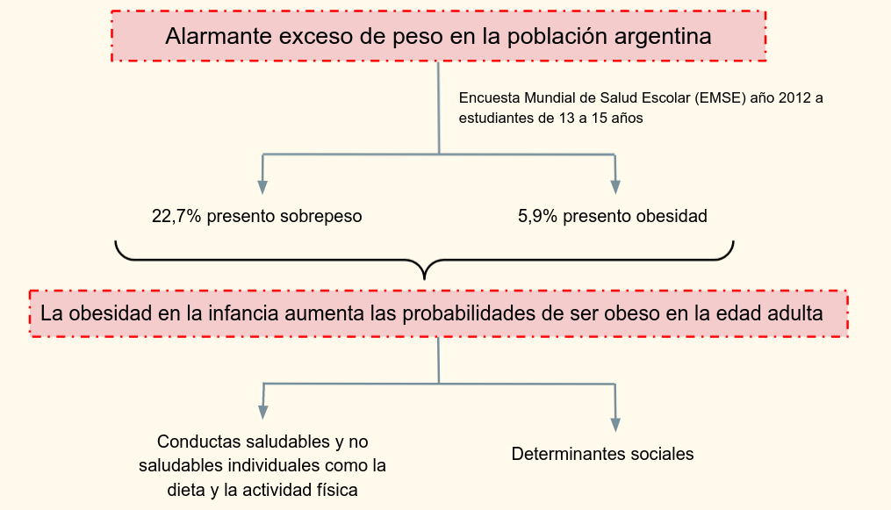

```{r setup, include=FALSE}
#knitr::opts_chunk$set(echo = TRUE)
```

Esta investigación se enmarca en el Proyecto MEESA – Mejorando los entornos escolares para la salud en Argentina. Centro de Estudios de Estado y Sociedad (CEDES). Con financiamiento del MinCyT, Global Alliance for Chronic Diseases (GACD). BID 3772-OC/AR. 


## Introducción




Para analizar este problema contamos con una base de datos provista por la cátedra de Biome2.

```{r}
df <- read.csv("bd_entornos.csv", fileEncoding = "ISO-8859-1") # levanto los datos
df_size <- dim(df)
```

El conjunto de datos cuenta con `r df_size[2]` variables y  `r df_size[1]` observaciones.

Breve descripción de las variables:

  * Variables explicativas:
   
    * ID: identificador de cada caso
    * Escuela: identificador de la escuela, representado por un factor de 6 niveles que son la combinación del tipo de gestión: Pública o Privada y el Nivel socio económico: Bajo, Medio, Alto.
    * Grado: se tomaron 2 cursos de cada escuela: 1ero y 2do
    * age: representa la edad de cada caso (entre `r min(df$age, na.rm = T)` y `r max(df$age, na.rm = T)`, con una media de `r mean(df$age, na.rm = T)`, y una mediana de `r median(df$age, na.rm = T)`)
    * sex: con 3 valores válidos: Femenino, Masculino y Otro
    * parent_ed4: máxima educación alcanzada de los padres con 4 valores: Bajo, Medio, Alto y NS/NC.
    * fas3: nivel de fluides economica familiar, con 3 valores: Bajo, Medio, Alto.
    * ses_auto: nivel socio economico auto percibido
    * conectiv_i: conectividad
    * salud_auto:  salud auto percibida

    
  * Variable respuesta:

    * fruta: que indica dicotomicamente si come o no al menos 2 frutas por día

  * Variables descartadas de la base:

    * beb_azuc
    * af_hasta2h


# Limpieza de los datos

Realizamos una limpieza de la base, eliminando las columnas que no utilizamos y las filas que encontraban con datos faltantes.


```{r}
data <-  na.omit(df)
drop <- names(data) %in% c("beb_azuc","af_hasta2h")
data<-data [,!drop]
data <- data[data$sex!="Otro", ] 
data <- data[data$sex!="", ] 
```

Luego de estas operaciones nos quedamos con una base de datos con `r dim(data)[2]` variables y  `r dim(data)[1]` observaciones.
Descartamos `r round((1 - dim(data)[1]/df_size[1]) *100,2) `% de los datos.


# Análisis descriptivo


# Modelos explorados

Para la realización y evaluacion de modelos utilizamos las bibliotecas lme4, DHARMa, car, emmeans
```{r message=FALSE}
library(lme4)
library(DHARMa)
library(car)
library(emmeans)
```

Modelo 3:
```{r}
m3<-glm(fruta ~  grado, data =data, family = binomial)
summary(m3) 
Anova(m3)
```


